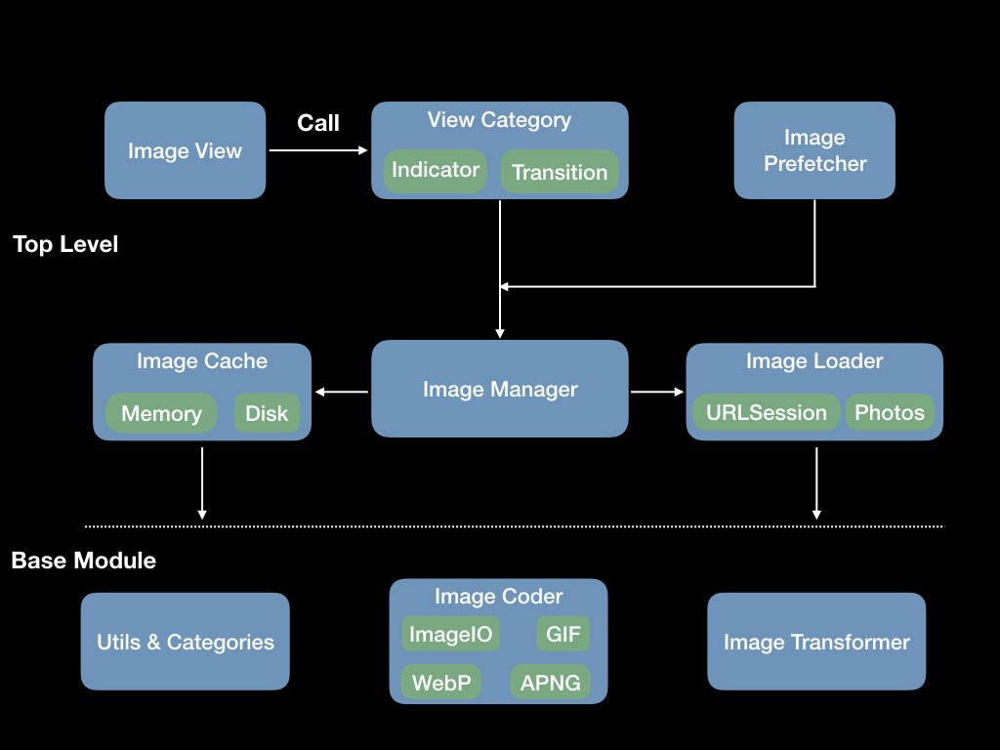
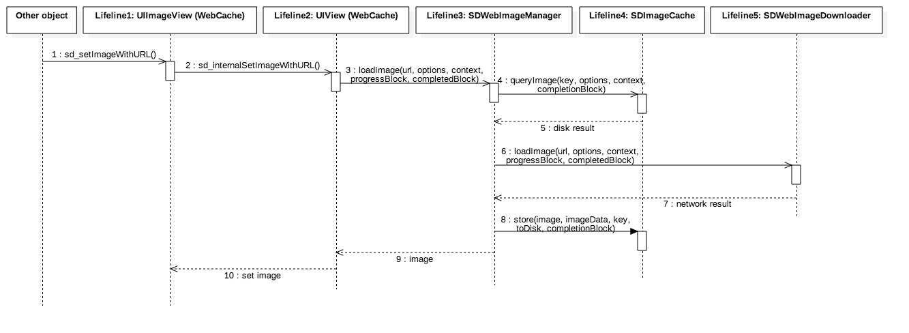
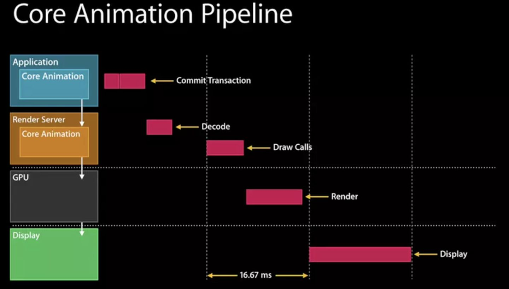
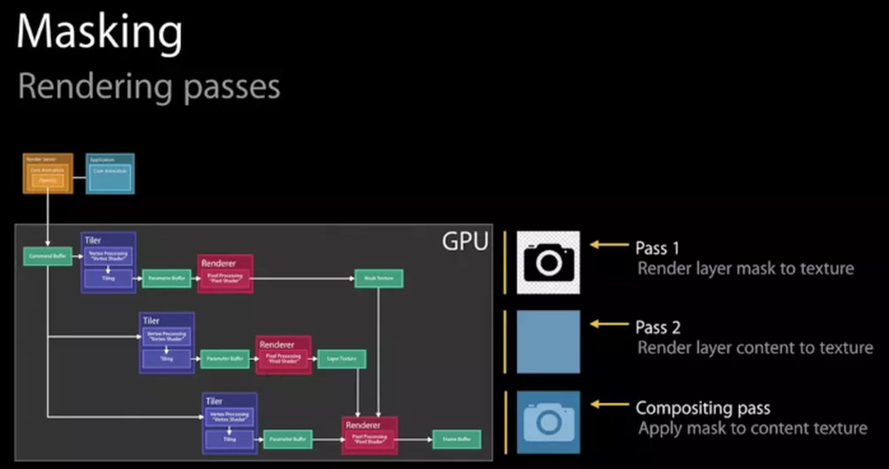
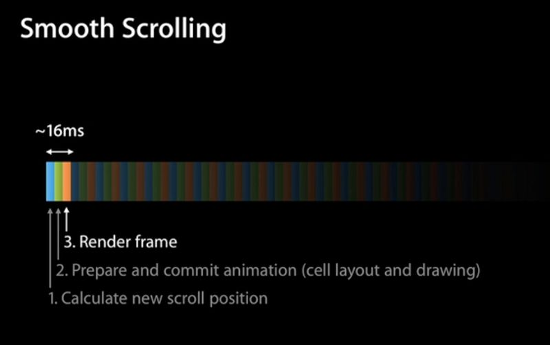
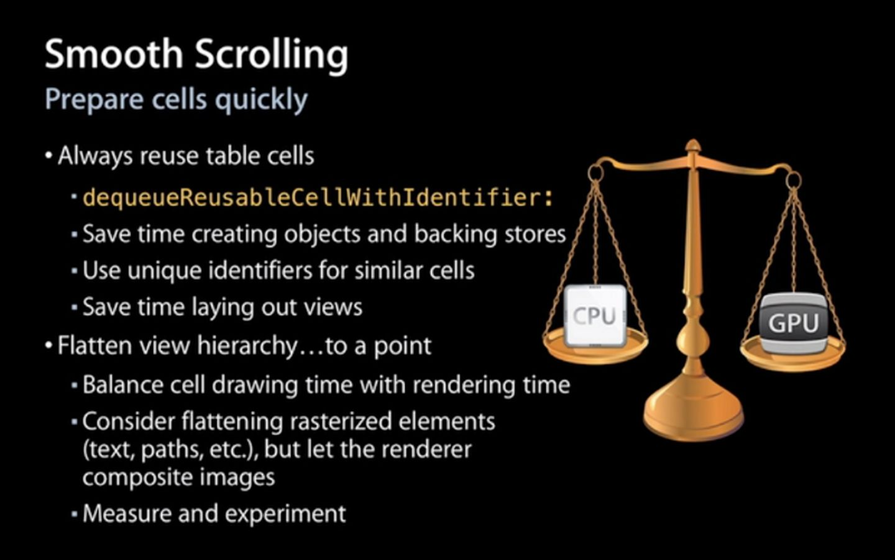
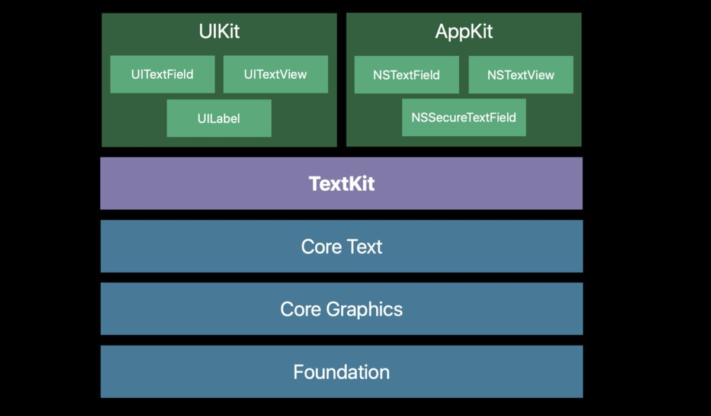
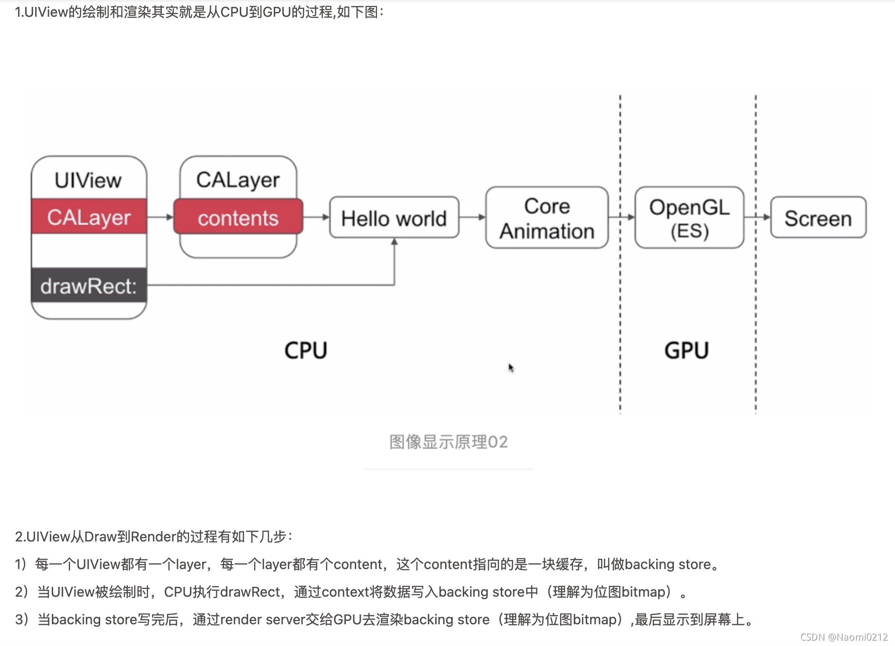

## iOS Interview

0. 自我介绍

```
我先自我介绍一下，我叫朱双泉，目前就职于华润大健康板块下具体负责电商业务产品设计和开发，在就职期间分别负责iOS，前端，后端和产品的工作，对软件工程有了更加全面的视角，通过了不同职责的探索后，现在想着力深耕iOS技术，希望能够和优秀的人做有挑战的事。
```

1. 两个整数相加;

```cpp
int getSum(int a, int b){
    while (b != 0) {
        int carry = (unsigned int)(a & b) << 1;
        a = a ^ b;
        b = carry;
    }
    return a;
}
```

```
思路:
- a + b的问题拆分为 (a + b 无进位的结果) 和 (a 和 b的进位结果)
- 无进位加法使用异或运算计算得出
- 进位结果使用与运算和移位运算计算得出
- 循环此过程, 直到进位为0
```

2. Runloop 的 mode？ autorelease 的释放时机?

```
Runloop 的 mode

- Runloop: RunLoop启动时只能选择其中一个Mode，作为currentMode
  - mode (currentMode) kCFRunLoopDefaultMode: App的默认Mode, 通常主线程是在这个Mode下运行
    - timers NSTimer / performSelector:withObject:afterDelay:
    - source0 触摸事件处理 / performSelector:onThread
    - source1 基于Port的线程间通信 / 系统事件捕捉
    - observers 用于监听RunLoop的状态
      - kCFRunLoopEntry          // 即将进入Loop
      - kCFRunLoopBeforeTimers   // 即将处理Timer
      - kCFRunLoopBeforeSources  // 即将处理Source
      - kCFRunLoopBeforeWaiting  // 即将进入休眠 + UI刷新 + Autorealease pool // 等待 mach_port消息
      - kCFRunLoopAfterWaiting   // 刚从休眠中唤醒 // 接收 mach_port消息
      - kCFRunLoopExit           // 即将退出Loop
      - kCFRunLoopAllActivities
  - mode UITrackingRunLoopMode: 界面跟踪 Mode，用于 ScrollView 追踪触摸滑动，保证界面滑动时不受其他 Mode 影响
    - timers
    - source0
    - source1
    - observers

- 如果需要切换Mode，只能退出当前Loop，再重新选择一个Mode进入
- 不同组的Source0/Source1/Timer/Observer能分隔开来，互不影响
- 如果Mode里没有任何Source0/Source1/Timer/Observer，RunLoop会立马退出

```

```
autorelease 的释放时机

答案: 当 RunLoop 处于 kCFRunLoopBeforeWaiting, kCFRunLoopBeforeExit时释放

iOS在主线程的Runloop中注册了2个Observer
- 第1个Observer监听了kCFRunLoopEntry事件，会调用objc_autoreleasePoolPush()
- 第2个Observer
  - 监听了kCFRunLoopBeforeWaiting事件，会调用objc_autoreleasePoolPop()、objc_autoreleasePoolPush()
  - 监听了kCFRunLoopBeforeExit事件，会调用objc_autoreleasePoolPop()

```

3. runtime 的 category 中实现了跟他一样的一个方法会怎么样？

```
答案: 会直接被category中的方法覆盖
```

```
Category 实现原理

- Category编译之后的底层结构是struct category_t，里面存储着分类的对象方法、类方法、属性、协议信息
- 在程序运行的时候，runtime会将Category的数据，合并到类信息中(类对象、元类对象中)
*rw = category(属性 协议 方法) -> +  ro
*分类结构中没有成员变量

category_t
  - name               // 分类名
  - cls                // 宿主类
  - instanceMethods    // 实例方法
  - classMethods       // 类方法
  - protocols          // 协议
  - instanceProperties // 实例属性
  - classProperties    // 类属性

Category 加载处理过程 (运行时决议)
1. 通过 Runtime 加载某个类色所有 Category 数据
2. 把所有 Category 的方法,属性,协议数据合并到一个大数组中, 后面参与编译的Category,会在数组的前面
3. 将合并后的分类数据 (方法,属性,协议), 插入到类原来数据的前面

Category和Class Extension的区别是什么?
- Class Extension在编译的时候，它的数据就已经包含在类信息中
- Category是在运行时，才会将数据合并到类信息中
*类扩展其实是类的一部分, 编译期决议, 分类是运行时决议
```

```
Category能否添加成员变量?如果可以，如何给Category添加成员变量?
- 不能直接给Category添加成员变量，但是可以间接实现Category有成员变量的效果
*原因是分类数据结构没有定义字段, 可以使用关联对象绑定
```

```
关联对象

AssociationsManager {             // 单例对象
  map AssociationsHashMap {       // 持有一个哈希表
    obj : disguised_ptr_t         // 存放每个对象
    map : ObjectAssociationMap {  // 存放每个对象拥有的成员变量哈希表
        key : void * // 唯一性key
        value : ObjcAssociation { // 成员变量值包装类
          policy : uintptr_t  // 内存策略
          id     : value      // 实际变量值
        }
    }
  }
}
```

4. kvo 的实现，有没有遇到过崩溃

```
kvo 的实现

答案: 用Runtime动态生成一个子类,并让instance对象isa指向这个全新的子类
*类似Java动态代理CGLib的设计思路, 是一种Proxy模式

有没有遇到过崩溃 iOS11及以上不会发生崩溃

1. observe忘记写监听回调方法 observeValueForKeyPath
2. add和remove次数不匹配
3. 监听者和被监听者dealloc之前没有remove（其实也原因2，但是监听者和被监听者的生命周期不同）

情型一、obsever没有实现observeValueForKeyPath方法
情型二、没有移除KVO 比如observer是VC在pop的时候没有在dealloc中removeKVO
情型三、多次移除KVO
情型四、多次添加相同KVO但是remove次数不同（如果add 和remove相匹配不会崩溃 例子中在dealloc中remove两次）
情形五 监听者和被监听者的生命周期不同

解决方案 FBKVOController
```

```
iOS用什么方式实现对一个对象的KVO?(KVO的本质是什么?)
- 利用RuntimeAPI动态生成一个子类，并且让instance对象的isa指向这个全新的子类
- 当修改instance对象的属性时，会调用Foundation的_NSSetXXXValueAndNotify函数
1. willChangeValueForKey
2. 父类原来的setter
3. didChangeValueForKey:
- 内部会触发监听器(Oberser)的监听方法( observeValueForKeyPath:ofObject:change:context:)

如何手动触发KVO?
- 手动调用willChangeValueForKey:和didChangeValueForKey:

直接修改成员变量会触发KVO么?
- 不会触发KVO
*调用了原来的父类的setter方法
```

5. 单例的优缺点

```
答案:
优点:
1. 只有确定整个App中语义唯一性, 可以避免新的内存分配
2. 减少内存开支
3. 减少系统的性能开销
4. 避免对资源的多重占用
缺点:
1. 可测试性差, 应该避免使用
2. 扩展很困难
3. 不适用于变化的对象
4. 例类的职责过重
```

6. sqlite 什么时候适合用索引

```
1. 在经常需要搜索的列上，这是毋庸置疑的
2. 经常同时对多列进行查询，且每列都含有重复值可以建立组合索引，组合索引尽量要使常用查询形成索引覆盖（查询中包含的所需字段皆包含于一个索引中，我们只需要搜索索引页即可完成查询）。
3. 在经常用在连接的列上，这些列主要是一些外键，可以加快连接的速度，连接条件要充分考虑带有索引的表。
4. 在经常需要对范围进行搜索的列上创建索引，因为索引已经排序，其指定的范围是连续的，同样，在经常需要排序的列上最好也创建索引。
5. 在经常放到where子句中的列上面创建索引，加快条件的判断速度。
```

7. 算法, atoi

```cpp
int myAtoi(char * s){
    unsigned long len = strlen(s);
    // 去除前导空格
    int index = 0;
    while (index < len) {
        if (s[index] != ' ') {
            break;
        }
        index++;
    }
    if (index == len) {
        return 0;
    }
    int sign = 1;
    // 处理第 1 个非空字符为正负符号，这两个判断需要写在一起
    if (s[index] == '+') {
        index++;
    } else if (s[index] == '-') {
        sign = -1;
        index++;
    }
    // 根据题目限制，只能使用 int 类型
    int res = 0;
    while (index < len) {
        char curChar = s[index];
        if (curChar < '0' || curChar > '9') { // 如果不是数字, 则直接判定转换失败
            break;
        }
        int num = (curChar - '0'); // 减去ascii表, 获取number
        if (res > INT_MAX / 10 || (res == INT_MAX / 10 && num > INT_MAX % 10)) {
            return INT_MAX;
        }
        if (res < INT_MIN / 10 || (res == INT_MIN / 10 && num > -(INT_MIN % 10))) {
            return INT_MIN;
        }
        res = res * 10 + sign * num;
        index++;
    }
    return res;

}
```

```
字符串的转换
- 明确转化规则
  - 空格处理
  - 正负号处理
  - 数字处理
- [推入]数字
  - result = result * 10 + num
- 模式识别: 整数运算注意溢出
  - 转换为INT_MAX的逆运算
```

8. autoreleasepool 实现原理

```
// 自动释放池的主要底层数据结构是:__AtAutoreleasePool、AutoreleasePoolPage
// 调用了autorelease的对象最终都是通过AutoreleasePoolPage对象来管理的
__AtAutoreleasePool {
  currentPage: AutoreleasePoolPage { // 每个AutoreleasePoolPage对象占用4096字节内存 4kb
    magic: magic_t
    *next: id // 指向了下一个能存放autorelease对象地址的区域
    thread: pthread_t
    parent: AutoreleasePoolPage // 双向链表
    child: AutoreleasePoolPage  // 双向链表
    depth: uint32_t
    hiwat: uint32_t
    ... 剩下的空间用来存放 autorelease 对象的地址
  }
}
- 每个AutoreleasePoolPage对象占用4096字节内存，除了用来存放它内部的成员变量，剩下的空间用来存放 autorelease对象的地址
- 所有的AutoreleasePoolPage对象通过双向链表的形式连接在一起
```

```
autoreleasepool 行为逻辑

嵌套时:
- 调用push方法会将一个POOL_BOUNDARY入栈，并且返回其存放的内存地址
- 调用pop方法时传入一个POOL_BOUNDARY的内存地址，会从最后一个入栈的对象开始发送release消息，直到遇到这个
   POOL_BOUNDARY
*双向链表的结构 + 栈的内存管理模式
```

9. 自旋锁, 互斥锁

```
答案

自旋锁: 等待锁的线程会处于忙等状态, 一直占用CPU资源, 不进行线程切换
互斥锁: 等待锁的线程会处于休眠状态, 进行线程切换
*关注点: 操作系统的线程调度算法

什么情况使用自旋锁比较划算?
1. 预计线程等待锁的时间很短
2. 加锁的代码(临界区)经常被调用，但竞争情况很少发生
3. CPU资源不紧张
4. 多核处理器

什么情况使用互斥锁比较划算?
1. 预计线程等待锁的时间较长
2. 单核处理器
3. 临界区有IO操作
4. 临界区代码复杂或者循环量大
5. 临界区竞争非常激烈

*关注点, 加锁临界区的等待操作系统响应时间短的 使用自旋锁, 时间长的用互斥锁,
```

```
线程同步方案:

自旋锁:
- OSSpinLock ”自旋锁”，等待锁的线程会处于忙等(busy-wait)状态，一直占用着CPU资源 (目前已经不再安全，可能会出现优先级反转问题)
如果等待锁的线程优先级较高，它会一直占用着CPU资源，优先级低的线程就无法释放锁

互斥锁:
- os_unfair_lock 从iOS10开始才支持
从底层调用看，等待os_unfair_lock锁的线程会处于休眠状态，并非忙等

- pthread_mutex
”互斥锁”，等待锁的线程会处于休眠状态

- NSLock // 对mutex普通锁的封装
- NSRecursiveLock // 也是对mutex递归锁的封装，API跟NSLock基本一致
- NSCondition // 是对mutex和cond的封装
- NSConditionLock // 是对NSCondition的进一步封装，可以设置具体的条件值

信号量: IPC进程间通信
- dispatch_semaphore
信号量的初始值，可以用来控制线程并发访问的最大数量
信号量的初始值为1，代表同时只允许1条线程访问资源，保证线程同步

串行队列:
- dispatch_queue(DISPATCH_QUEUE_SERIAL)
直接使用GCD的串行队列，也是可以实现线程同步的
```

```
线程同步方案性能比较:
1. os_unfair_lock
2. OSSpinLock
3. dispatch_semaphore
4. pthread_mutex
5. dispatch_queue(DISPATCH_QUEUE_SERIAL)
6. NSLock
7. NSCondition
8. pthread_mutex(recursive)
9. NSRecursiveLock
10. NSConditionLock
11. @synchronized
```

```
读写安全方案:

同一时间，只能有1个线程进行写的操作
同一时间，允许有多个线程进行读的操作
同一时间，不允许既有写的操作，又有读的操作

上面的场景就是典型的“多读单写”，经常用于文件等数据的读写操作，iOS中的实现方案有

1. pthread_rwlock:读写锁 // 等待锁的线程会进入休眠
2. dispatch_barrier_async:异步栅栏调用

- 这个函数传入的并发队列必须是自己通过dispatch_queue_cretate创建的
- 如果传入的是一个串行或是一个全局的并发队列，那这个函数便等同于dispatch_async函数的效果
```

10. Swift, OC 差异

```
编程范式:

OC 结构化 + 面向对象
Swift 结构化 + 面向对象 + 函数式 + 面向协议
*最主要的差异是编程范式进化到了函数式(一等公民, 不可变类型, 值对象, Optional, map, filter, reduce等, SwiftUI声明式)
*主要的转变在于从 怎么做 -> 做什么, 但带来的是新语法太多, 掌握起来困难, 这点不如Go

Swift 类型安全   // 需要明确值的类型
Swift 值类型增强 // 基本都是值类型 和 Go 相同
Swift 枚举增强  // 可以使用各种类型和模式匹配
Swift 泛型编程  // OC的泛型约束只停留在编译器警告阶段
Swift 访问权限  // 更加细化, 能更好的够分离关注点
Swift 协议和扩展
Swift 函数和闭包 // 一等公民
```

11. HTTPS 加密与身份验证

```
答案: HTTPS 加密与身份验证部分是由TLS/SSL协议完成的
*包括两块, 第一是握手协议, 第二是记录协议, 握手协议使用非对称加密算法, 记录协议使用对称加密算法

设计目的是: 身份验证, 保密性, 完整性

TLS协议包括:
- Handshake握手协议
  - 验证通讯双方的身份
  - 交换加解密的安全套件 // 证书信任链 (使用hash算法来做验签 私钥)
    - 秘钥交换算法 ECDHE
    - 身份验证算法 RSA(非对称加密) 椭圆曲线 需要随机选择两个不相等的质数
    - 对称加密算法, 强度, 工作模式(分组)
  - 协商加密参数
- Record记录协议
  - 对称加密
    - 异或填充 ^ + padding
```

```
TLS1.2 通讯过程

1. 验证身份
2. 达成安全套件共识
3. 传递秘钥
4. 加密通讯

1 -> Client Hello        // 发送支持的安全套件列表
2 <- Server Hello        // 选择安全的套件列表, nginx中有一个表维护
3 <- Server Certificates // 发送服务端的证书
4 <- ServerKey Exchange  // 发送服务端的公钥
5 <- Server Hello Done   // 服务端结束, 仅传递信息
6 -> ClientKey Exchange  // 检查服务端证书, 发送客户端公钥
7 -> CipherSpec Exchange // 生成客户端秘钥发送给服务端 (主秘钥)
8 -> Finish              // 客户端结束, 仅传递消息
9 <- CipherSpec Exchange // 生成服务端秘钥发送给客户端 (主秘钥)
10 <- Finish             // 服务端结束, 仅传递消息

... 通过预主秘钥进行对称加密通信

TLS 1.3 因为限制了服务端的安全加密套件个数及sesson等一系列的优化, 可实现 0RTT握手
为了兼容 1.1、1.2 等“老”协议，TLS1.3 会“伪装”成 TLS1.2，新特性在“扩展”里实现；
1 -> Client Hello
  -> Key Share
  -> Early Data

2 <- Server Hello
  <- Key Share
  <- Early Data
  <- Finish
```

12. TCP, UDP 区别

|              |           TCP            |                 UDP                  |
| :----------: | :----------------------: | :----------------------------------: |
|    连接性    |         面向连接         |                无连接                |
|    可靠性    |     可靠传输,不丢包      | 不可靠传输, 尽最大努力交付, 可能丢包 |
| 首部占用空间 |            大            |                  小                  |
|   传输速率   |            慢            |                  快                  |
|   资源消耗   |            大            |                  小                  |
|   应用场景   | 浏览器,文件传输,邮件发送 |           音视频通话,直播            |
|  应用层协议  | HTTP,HTTPS,FTP,SMTP,DNS  |                 DNS                  |

```
TCP 可靠性传输: 连续ARQ + 滑动窗口 + SACK选择性确认
TCP 序号:
- 占4字节,
- 首先, 在传输过程的每一个字节都会有一个编号
- 在建立连接后, 序号代表: 这一次传给对方的TCP数据部分的第一个字节的编号
TCP 确认号:
- 占4字节,
- 在建立连接后, 确认号代表: 期望对方下一次传过来的TCP数据部分的第一个字节的编号
TCP 窗口
- 占2字节
- 这个字段有流量控制的功能, 用以告知对方下一次允许发送的数据大小(单位是字节)
TCP 超出一定的重传次数或时间, 还未收到来自对端的确认报文, 于是发送reset报文 (举例5次 看系统)
```

```
TCP 分段

为什么选择在传输层就将数据“大卸八块”分成多个段，而不是等到网络层再分片传递给数据链路层?
- 因为可以提高重传的性能
- 需要明确的是:可靠传输是在传输层进行控制的
✓ 如果在传输层不分段，一旦出现数据丢失，整个传输层的数据都得重传
✓ 如果在传输层分了段，一旦出现数据丢失，只需要重传丢失的那些段即可
```

```
TCP 流量控制

如果接收方的缓存区满了, 发送方还在疯狂着发送数据
- 接收方只能把收到的数据包丢掉, 大量的丢包会极大着浪费网络资源
- 所以要进行流量控制

什么是流量控制?
- 让发送方的发送速率不要太快, 让接收方来得及接收处理

原理:
- 通过确认报文中窗口字段来控制发送方的发送速率
- 发送方的发送窗口大小不能超过接收方给出窗口大小
- 当发送方收到接收窗口的大小为0时, 发送方就会停止发送数据

特殊情况:
- 一开始,接收方给发送方发送了0窗口的报文段
- 后面, 接收方又有了一些存储空间, 给发送方发送的非0窗口的报文段丢失了
- 发送方发送的窗口一直为零, 双方陷入僵局

解决方案:
- 当发送方收到0窗口通知时,这时发送方停止发送报文
- 并且同时开启一个定时器, 隔一段时间就发个测试报文询问接收方最新的窗口大小
- 如果接收的窗口大小还是0, 则发送方再次刷新启动定时器
```

13. TCP 拥塞控制原理

```
拥塞控制
- 防止过多的数据注入到网络中
- 避免网络中的路由器或链路过载

拥塞控制是一个全局性的过程
- 涉及到所有的主机, 路由器
- 以及与降低网络传输性能有关的所有因素
- 是大家共同努力的结果

相比而言, 流量控制是点对点通信的控制

MSS: 每个段最大的数据部分大小 (在建立连接时确定)
cwnd, congestion window: 拥塞窗口
rwnd, receive window: 接收窗口
swnd, send window: 发送窗口 swnd = min(cwnd, rwnd)
发送窗口的最大值: swnd = min(cwnd, rwnd)
- 当rwnd<cwnd, 是接收方的能力限制发送窗口的最大值
- 当cwnd<rwnd, 则是网络的拥塞限制发送窗口的最大值

方法:
- 慢开始
  - cwnd的初始值比较小, 然后随着数据包被接收方确认(收到一个ACK), cwnd就成倍增长 (指数级)
- 拥塞避免
  - ssthresh (slow start threhold): 慢开始阈值, cwnd达到阈值后, 以线性方式增加
  - 拥塞避免 (加法增大): 拥塞窗口缓慢增大, 以防止网络过早出现拥塞
  - 乘法减小: 只要网络出现拥塞, 把ssthresh减为拥塞峰值的一半, 同时执行慢开始算法 (cwnd又恢复到初始值)
  - 当网络出现频繁拥塞时, ssthresh值就下降的很快
- 快速重传
  - 接受方
    - 每收到一个失序的分组后就立即发送重复确认
    - 使发送方及时知道有分组没有到达
    - 而不要等待自己发送数据时才进行确认
  - 发送方
    - 只要连续收到三个重复确认(总共4个相同的确认), 就应该立即重传对方尚未收到的报文段
    - 而不必继续等待重传计时器到期后再重传
- 快速恢复
  - 当发送方连续收到三个重复确认, 说明网络出现拥塞
    - 就执行"乘法减小"算法, 把ssthresh减为拥塞峰值的一半
  - 与慢开始不同之处是现在不执行慢开始算法, 即cwnd现在不恢复到初始值
    - 而是把cwnd值设置为新的ssthresh值(减小后的值)
    - 然后开始执行拥塞避免算法("加法增大"), 使拥塞窗口缓慢地线性增大
```

14. SDWebImage



```
- Image Manager
  - Image Cache
    - Memory
    - Disk
  - Image Loader
    - URLSession
    - Photos
```

15. 图片解码

```
Image/IO
```

16. 指针混淆

```
代码混淆

iOS程序可以通过class-dump、Hopper、IDA等获取类名、方法名、以及分析程序的执行逻辑
如果进行代码混淆，可以加大别人的分析难度

iOS的代码混淆方案
- 源码的混淆
  - 类名
  - 方法名
  - 协议名

- LLVM中间代码IR混淆
  - 自己编写Pass

- 宏定义的混淆
  - 注意点:
    - 不能混淆系统方法
    - 不能混淆init开头的初始化方法
    - 混淆属性时需要额外注意set方法
    - 如果xib, storyboard中用到了混淆的内容, 需要手动修正
    - 可以考虑把需要混淆的符号都加上前缀, 跟系统自带的符号做区分
    - 混淆过多可能会被AppStore拒绝上架, 需要说明用途

  - 建议
    - 给需要混淆的符号加上一个特定的前缀

- 字符串加密
  - 很多时候, 可执行文件中的字符串信息, 对破解者来说非常关键, 是破解的途径之一
  - 为了加大破解, 逆向难度, 可以考虑对字符串进行加密
  - 字符串的加密技术有很多种, 可以根据自己的需要自行定制算法
  - 这里举一个简单的例子
    - 对每个字符进行异或(^)处理
    - 需要使用字符串时, 对异或(^)过的字符再进行一次异或(^), 就可以获得原字符
```

17. TagPointer

```
用指针存储小对象

从64bit开始，iOS引入了Tagged Pointer技术，用于优化NSNumber、NSDate、NSString等小对象的存储

在没有使用Tagged Pointer之前， NSNumber等对象需要动态分配内存、维护引用计数等，NSNumber指针存储的是堆中NSNumber对象的地址值

使用Tagged Pointer之后，NSNumber指针里面存储的数据变成了:Tag + Data，也就是将数据直接存储在了指针中

当指针不够存储数据时，才会使用动态分配内存的方式来存储数据

objc_msgSend能识别Tagged Pointer，比如NSNumber的intValue方法，直接从指针提取数据，节省了以前的调用开销
```

18. NSString 为什么用 copy 修饰

```
答案: 保持传入字符串的的不可变性
如果传入的是NSMutableString, 使用时不会被更改, 更安全
如果用 strong 修饰的话, 可能会在外部修改内部的值
```

19. 重写 isEqual 方法，hash 方法的作用，引出 NSSet 的读写效率比较高

```
答案;

isEqual 方法用于比较元素相等
hash 方法用于减少哈希碰撞

NSSet 底层是哈希表,使用hash进行散列到对应的槽, 再使用isEqual来判断, 链表法
```

20. performselector 和直接调用方法哪个执行快

```
答案 直接调用更快, performselector会执行额外的消息发送机制

performSelector: withObject:是在iOS中的一种方法调用方式。他可以向一个对象传递任何消息，而不需要在编译的时候声明这些方法。所以这也是runtime的一种应用方式.所以performSelector和直接调用方法的区别就在与runtime。

- 直接调用编译是会自动校验。如果方法不存在，那么直接调用 在编译时候就能够发现，编译器会直接报错。
- 但是使用performSelector的话一定是在运行时候才能发现，如果此方法不存在就会崩溃。
```

21. 为什么一个线程只能有一个 runloop

```
答案:

从底层数据结构来看, runloop 持有一个 thread, 一对一关系, 主线程默认开启Runloop
从功能设计来看, 一个线程设计成只有一个RunLoop, 是因为RunLoop里面有一个无限循环.
```

22. 子线程的 runloop 开启后，如果不做任何操作，线程会被杀死吗？

```
答案: 会

如果Mode里没有任何Source0/Source1/Timer/Observer，RunLoop会立马退出
```

23. load 方法是在什么时候调用的

```
答案: load方法在runtime加载类、分类的时候调用

Category中有load方法吗?load方法是什么时候调用的?load 方法能继承吗?
- 有load方法
- load方法在runtime加载类、分类的时候调用
- load方法可以继承，但是一般情况下不会主动去调用load方法，都是让系统自动调用
*系统调用load方法是直接指针调用, 主动调用会走消息机制

load、initialize方法的区别什么?它们在category中的调用的顺序?以及出现继承时他们之间的调用过程?
- +load方法会在runtime加载类, 分类时调用
- 每个类, 分类的+load, 在程序运行过程中系统只调一次

调用顺序
1. 先调用类的+load
- 按照编译先后顺序调用 (先编译, 先调用)
- 调用子类的+load之前会调用父类的+load
2. 再调用分类的+load
- 按照编译先后顺序调用 (先编译, 先调用)
*顺序: 父类 -> 子类 -> 分类 (同级别先编译, 先调用)
```

24. initialize 方法是干嘛用的？是什么时候调用的 -

```
答案 +initialize方法在类第一次接收到消息时调用

调用顺序
- 先调用父类的+initialize, 再调用子类的+initialize
- (先初始化父类, 再初始化子类, 每个类只会初始化1次)
- +initialize和+load的很大区别是，+initialize是通过objc_msgSend进行调用的，所以有以下特点
- 如果子类没有实现+initialize，会调用父类的+initialize(所以父类的+initialize可能会被调用多次)
- 如果分类实现了+initialize，就覆盖类本身的+initialize调用
*initialize走消息机制, 所以行为同消息机制
```

25. repeated 的 NSTimer 有什么性能问题

```
答案: 可能会造成内存泄漏

NSTimer涉及到内存泄漏，主要是指在Timer中repeats为YES，
即需要间隔指定时间，重复调用方法，此时需要手动调用[self.timer invalidate]使定时器失效。

如果repeats为NO，则不存在内存泄漏问题，调用完成后，定时器会自动失效。

解决办法:

1. viewWillDisappear:手动停止
  - 需要注意在这个方法中停止，适用于不会从当前页面push出下一个页面的情况，因为如果push出下一个页面，也会调用viewWillDisappear:，可能就得不到正确的结果。
2. 重写返回方法手动停止
3. iOS10之后，系统提供的scheduledTimerWithTimeInterval:repeats:block方法
4. 去除NSTimer和当前调用对象之间的循环引用。 (weak target)
```

26. 算法：二叉树的左右子树交换代码实现；

```cpp
struct TreeNode* invertTree(struct TreeNode* root) {
    if (root == NULL) {
        return NULL;
    }
    struct TreeNode* left = invertTree(root->left);
    struct TreeNode* right = invertTree(root->right);
    root->left = right;
    root->right = left;
    return root;
}
```

27. 页面路由如何实现，如何去维护一张路由表；页面是如何去进行跳转的（runtime）；路由表中的键和值分别是什么？如何根据服务器下发的数据加载页面；

```
1. 哈希表
2. 协议
3. 中间者模式 CTMediator + 组件化使用 category Runtime(反射)解耦 使用 Proxy
4. 字典树
```

28. js 和 OC 如何调用；（js 是怎样调用 oc 的）；

```
1. UIWebView (已于iOS12淘汰)
- stringByEvaluatingJavaScript urlscheme
- window.location.href = "ios://openPhotoGallery";

2. WKWebView
- 创建WKWebViewConfiguration对象，配置各个API对应的MessageHandler。
- window.webkit.messageHandlers

JSBridge
```

29. GCD 和 NSOperation 的区别；哪一个的复用性更好；NSOperation 的队列可以 cancel 吗，里面的任务可以 cancel 吗；

```
GCD
- 旨在代替NSThread等线程技术
- 充分利用设备的多核

NSOperation
- 基于GCD(底层是GCD)
- 比GCD多了一些更简单实用的功能 (队列的暂停和恢复以及取消)
- 使用更加面向对象

NSOperation是GCD的一层封装

NSOperationQueue的复用性更好, 是GCD的面向对象的封装

NSOperation 的队列可以 cancel 吗，里面的任务可以 cancel 吗；

- 最重要的是无论是NSOperation的cancel还是NSOperationQueue的cancelAllOperations 都不会停止正在执行的operation，只能取消在队列中等待的operation
```

30. block 和 self 的循环引用；到底是如何循环引用的；

```
答案: 可以使用 __weak 进行单边打破, 或者使用__block调用手动打破

循环引用是 由于对象持有了block, block又捕获了self
```

```
Block_layout : {
  isa: (void*)
  flags: (int)
  reserved: (int)
  invoke: (void*(void *, ...)) // *FuncPtr
  descriptor: (struct Block_descriptor *) {
    reserved: (unsigned long int)
    size: (unsigned long int)
    copy: (void *(void *, void *))
    dispose: (void *(void *))
  }
  variables... (capture) // 捕获局部变量, 不捕获全局变量
}
```

```
block的原理是怎样的? 本质是什么?
- 封装了函数调用以及调用环境的OC对象, 就是闭包的一种实现
- 本质上也是一个OC对象, 它内部也有个isa指针

__block的作用是什么?有什么使用注意点?

block的属性修饰词为什么是copy?使用block有哪些使用注意?
- block一旦没有进行copy操作，就不会在堆上
- 使用注意:循环引用问题

block在修改NSMutableArray，需不需要添加__block?
```

31. SDWebImage 的缓存策略，是如何从缓存中 hit 一张图片的；使用了几级缓存；缓存如何满了如何处理，是否要设置过期时间；



```
使用了内存和磁盘的缓存:

- 磁盘是时间空间维度:
 - 时间维度: 默认过期时间是1周 // static const NSInteger kDefaultCacheMaxCacheAge = 60 * 60 * 24 * 7; // 1 week
 - 空间维度: [SDImageCache sharedImageCache].maxCacheSize = 1024 * 1024 * 50; // 50M// 默认是没有设置
- 内存是空间维度: 缓存满了使用LRUCache进行淘汰

SDWebImage 会在每次 APP 结束的时候执行清理任务。 清理缓存的规则分两步进行。 第一步先清除掉过期的缓存文件。 如果清除掉过期的缓存之后，空间还不够。 那么就继续按文件时间从早到晚排序，先清除最早的缓存文件，直到剩余空间达到要求。

@interface SDImageCache : NSObject

@property (assign, nonatomic) NSInteger maxCacheAge;
@property (assign, nonatomic) NSUInteger maxCacheSize;

分别在应用进入后台和结束的时候，遍历所有的缓存文件，如果缓存文件超过 maxCacheAge 中指定的时长，就会被删除掉。

同样的， maxCacheSize 控制 SDImageCache 所允许的最大缓存空间。 如果清理完过期文件后缓存空间依然没达到 maxCacheSize 的要求， 那么就会继续清理旧文件，直到缓存空间达到要求为止。

上面是 maxCacheAge 的默认值，注释上写的很清楚，缓存一周。 再来看看 maxCacheSize。 翻了一遍 SDWebImage 的代码，并没有对 maxCacheSize 设置默认值。 这就意味着 SDWebImage 在默认情况下不会对缓存空间设限制。

查询 Disk Cache 的时候有一个小插曲，就是如果 Disk Cache 查询成功，还会把得到的图片再次设置到 Memory Cache 中。

缓存策略-SDWebImageOptions

- SDWebImageRetryFailed 下载失败了会再次尝试下载 (是否要重试失败的 URL)
- SDWebImageLowPriority 当UIScrollView等正在滚动时，延迟下载图片（放置scrollView滚动卡）
- SDWebImageCacheMemoryOnly 只缓存到内存中，不缓存到硬盘上
- SDWebImageProgressiveDownload 图片会一点一点慢慢显示出来（就像浏览器显示网页上的图片一样）
- SDWebImageRefreshCached 将硬盘缓存交给系统自带的NSURLCache去处理，当同一个URL对应的图片经常更改时可以用这种策略
```

32. 讲讲 RunLoop

```
Runloop 运行逻辑

1. 通知Observers: kCFRunLoopEntry
2. 通知Observers: kCFRunLoopBeforeTimers
3. 通知Observers: kCFRunLoopBeforeSources
4. 处理Blocks
5. 处理Source0 (可能会再次处理Blocks)
6. 如果存在Source1，就跳转到第8步
7. 通知Observers: kCFRunLoopBeforeWaiting(等待消息唤醒)
8. 通知Observers: kCFRunLoopAfterWaiting(被某个消息唤醒)
  1> 处理Timer
  2> 处理GCD Async To Main Queue
  3> 处理Source1
9. 处理Blocks
10. 根据前面的执行结果，决定如何操作
  1> 回到第02步
  2> 退出Loop
11. 通知Observers: kCFRunLoopExit

```

```
Runloop 应用范畴

- 定时器(Timer)、PerformSelector
- GCD Async Main Queue
- 事件响应、手势识别、界面刷新
- 网络请求
- AutoreleasePool

Runloop 基本作用

- 保持程序的持续运行
- 处理App中的各种事件(比如触摸事件、定时器事件等)
- 节省CPU资源，提高程序性能:该做事时做事，该休息时休息

Runloop 实际应用

- 控制线程声明周期 (线程保活)
- 解决NSTimer在滑动时停止工作的问题
- 监控应用卡顿
- 性能优化

Runloop 休眠原理

- mach_msg()
- 操作系统用户态到内核态的切换
- 内核态进程切换为不活跃

//BeforeSources 和 AfterWaiting 这两个状态能够检测到是否卡顿
if (runLoopActivity == kCFRunLoopBeforeSources || runLoopActivity == kCFRunLoopAfterWaiting) {
  //将堆栈信息上报服务器的代码放到这里
} //end activity

```

33. 讲讲 iOS 动画，比如 CoreAnimation；

```
CoreAnimation翻译过来就是核心动画,一组非常强大的API，用来做动画的，非常的简单，但是效果非常绚丽
CoreAnimation是跨平台的，既可以支持IOS，也支持MAC OS
CoreAnimation执行动画是在后台，不会阻塞主线程
CoreAnimation作用在CALayer，不是UIView

动画组, 帧动画, 缓冲曲线, 贝塞尔曲线

CALayer // 基本UIView类似属性, 可使用CGImage填充, 控制颜色, 位置, 动画等
- CATextLayer // 绘制String或者AttributeString
- CAShapeLayer // 具有path属性, 与图形上下文类似属性
- CAGradientLayer // 梯度层, 颜色渐变
- CAEmitterLayer // 发射器层, 控制粒子或散列效果
- CAEAGLayer // OpenGL ES绘制的层
- CAReplicationLayer // 用来自动赋值subLayer
- CAScrollLayer // 管理可滑动区域
- CATiledLayer // 管理一副可以分割的大图
- CATransformLayer // 渲染3D Layer层级

应用使用CA有三组图层对象，每组图层对象在显示内容到屏幕上扮演的角色不同：
- 图层模型树（或称图层树）是应用交互最多的，对象在此树中存储动画的目标值，当改变图层的属性，使用这些对象中的一个
- 表现层树包含任一正在运行动画的值，此树中的对象你不能修改。但你可以用这些对象去读取当前动画的值，可利用这些值作为一个动画的起始。
- 渲染树执行实际的动画且是CA所私有的
- 当然图层组织的层级结构如视图类似，实际上，图层的初始结构与视图的初始结构相一致，有时你可以使用图层代替视图减少消耗。
- 对于图层树中的每个对象会匹配表现层树和渲染层树中的一个对象，应用主要工作的对象是图层中，但也可能通过`presentationLayer`属性访问
表现层树中的对象

动画组
关键帧动画
平移缩放旋转
```

34. 屏幕上点击一个 View，事件是如何去响应的；

```
往往在子view超出父view时，超出的部分不会响应点击事件
原因就在于：iOS的事件响应机制

iOS的事件响应机制

- 用户触摸屏幕时，UIKit会生成UIEvent对象来描述触摸事件。对象内部包含了触摸点坐标等信息。
- 通过Hit Test确定用户触摸的是哪一个UIView。这个步骤通过- (UIView *)hitTest:(CGPoint)point withEvent:(UIEvent *)event方法来完成。
- 找到被触摸的UIView之后，如果它能够响应用户事件，相应的响应函数就会被调用。如果不能响应，就会沿着响应链（Responder Chain）寻找能够响应的UIResponder对象（UIView是UIResponder的子类）来响应触摸事件。

hitTest: Test确定用户触摸的是哪一个UIView
1. 从视图层级最底层的 window 开始遍历它的子 View。
2. 默认的遍历顺序是按照 UIView 中 Subviews 的逆顺序。
3. 找到 hit-TestView 之后，寻找过程就结束了。
4. 如果 View 的 userInteractionEnabled = NO，enabled = NO（ UIControl ），或者 alpha <= 0.01， hidden = YES 直接返回 nil（不再往下判断）。
5. 如果触摸点不在 view 中 (pointInSide)，直接返回 nil。
6. 如果触摸点在 view 中，逆序遍历它的子 View ，重复上面的过程，如果子View没有subView了，那子View就是hit-TestView。
7. 如果 view 的 子view 都返回 nil（都不是 hit-TestVeiw ），那么返回自身（自身是 hit-TestView ）。

当一个view被add到superView上的时候，他的nextResponder属性就会被指向它的superView

pointInSide: 点击的点是否在矩形框内

*事件捕获是从 Window 开始逐级遍历找到 View
*事件响应式从 View 开始调用next响应者 到 Window -> Application -> AppDelegate
```

35. 深拷贝与浅拷贝

```
答案:

深拷贝是会拷贝指针指向新申请的内存
浅拷贝是仅拷贝指针

[NSXXX copy] 会进行浅拷贝, 因为不可变所以只需要一份指针, 享元模式
[NSMutableXXX  copy] 会进行深拷贝
[NSXXX mutablecopy] 会进行深拷贝
[NSMutableXXX mutablecopy] 会进行深拷贝

只要和mutable相关, 只要会修改 都需要深拷贝
```

36. 属性有哪些修饰符

```
答案:

MRC：nonatomic,atomic,retain,assign,copy,readwrite,readonly
ARC：nonatomic,atomic,strong,weak,assign,copy,readwrite,readonly

nonatomic (多线程访问不安全, UI线程在主线程无资源竞争, 不需要加锁)
- nonatomic 表示非原子属性
- 并发访问性能高，但是访问不安全
- 它直接访问内存中的地址，不关心其他线程是否在改变这个值，并且中间没有死锁保护；所以可能拿不到完整的值

atomic
- atomic 表示原子属性
- 系统生成的 getter/setter 会保证 get、set 操作的完整性，不受其他线程影响
- 系统生成的 getter/setter 方法中，使用了 @synchronized(self)
- 如果一个线程正在执行 getter/setter，其他线程就得等待
- 如果有另一个线程同时在调 [property release]，那可能就会crash，因为 release 不受 getter/setter 操作的限制。
- 也就是说，atomic 修饰的属性只能说是读/写安全的，但并不是线程安全的
- 因为别的线程还能进行读写之外的其他操作。
- 线程安全需要开发者自己来保证。
- 系统默认的属性是 atomic

strong
- strong 表示对对象的强引用
- 强引用时，引用计数会 +1
- 给 strong 属性赋值时，setter 方法中会先 release 旧值再 retain 新值并赋值
- 两个对象之间相互强引用会造成循环引用，内存泄漏

weak
- weak 表示对象的弱引用
- 弱引用时，不会使传入的对象计数+1
- 被其修饰的对象随时可能被系统销毁回收
- 当该对象的引用计数为 0，则会被回收，对象被释放以后，weak 指针会被自动设置为 nil
- 在OC的运行时环境中，维护了一种 weak 表（哈希表）
- 这张哈希表用对象的首地址作为 key，用 weak 指针自身的地址组成的数组作为 value
- 当对象被释放后，通过这个对象的起始地址来找到所有指向它的 weak 指针，并将它们指向nil
- weak 多用于避免循环引用

assign
- assign 主要用于修饰基本数据类型
- 包括OC基本数据类型（NSInteger，CGFloat）和C数据类型（int, float, double, char）
- 基本数据类型存储在栈中，内存不用程序员管理。
- assign 也可以修饰对象，但是当对象被释放后，指针依然指向之前的内存地址。
- 此时，访问被释放的地址就会 crash
- 这个已经被释放了的对象被称为 僵尸对象
- assign 在 MRC 和 ARC 下都可以使用

retain
- 在 MRC 下使用，用于修饰对象
- 被 retain 修饰的对象，retainCount要+1
- retain 只能修饰 OC 对象，不能修饰非 OC 对象（如 Core Foundation 对象）
- retain 会增加对象的引用计数，而基本数据类型或者 Core Foundation 对象都没有引用计数
- 赋值时，先 release 旧值，再 retain 新值

copy 表示在赋值时使用传入值的一份拷贝
- 赋值时，创建了一个新的对象，并将传入对象的值全部拷贝到新对象
- 赋值后，新对象的 retainCount 为 1，而旧对象的 retainCount 不变
- 只能修饰对象类型，不能修饰基础数据类型
- 用copy修饰的对象，必须实现
- NSCopying 协议，也就是实现方法 -(id)copyWithZone:(nullable NSZone *)zone
- 系统自动生成的 setter 方法中会调用这个方法
- 至于 copy 是深拷贝还是浅拷贝完全是看 copyWithZone 的实现方式，copy 修饰符和深拷贝、浅拷贝没有关系
- 一般用于修饰不可变的属性（NSArray,NSDictionary,NSString,block）
- 即使用 copy 修饰 NSMutableArray，将一个可变 NSMutableArray 赋值给 copy 修饰的属性也会变成不可变数组 NSArray
- 若 a 被 copy 修饰，则 a = b 等价于 a = [b copy]。
- 为什么要用 copy 修饰 NSString ？
如果用 retain 修饰 NSString，
当把 NSMutableString 赋值给 NSString 时，只是拷贝了指针；
如果赋值后源字符串改变，这个属性值也跟着改变。（不可控）
如果用 copy 修饰 NSString，
当把 NSMutableString 赋值给 NSString 时，会生成一份拷贝内容；
即使赋值后源字符串改变，这个属性值也不会改变。（保证了安全）

readwrite
- readwrite 表示该属性可读可写
- 系统会自动创建 setter 和 getter 方法
- readwrite 是默认的属性修饰符

readonly
- readonly 表示该属性只可读，不可写
- 只会生成get方法
- 对用 readonly 修饰的属性赋值时，编译器会报错提示：“Assignment to readonly property”。
```

37. 将一个 NSArray 赋值给一个 copy 修饰的 NSMutableArray 属性，然后尝试向这个可变数组添加对象，会发生什么？

```
答案:

直接崩溃, 报找不到添加对象的方法, 找不到 selector

原因:
[NSMutableArray copy] -> NSArray, NSArray 没有添加对象的方法
```

38. Category 同名方法

```
答案:

会覆盖宿主类的同名方法, 原因是 Category是Runtime时加载运行, 头插法合成原对象ro -> rw.
```

39. Extention 可以有多个吗？

```
答案 : 可以有多个

不管有几个都会合成到宿主类的 ro 里, 多个的好处可以用来隔离关注点
```

40. Category 多个同名方法怎么进行 Method swizzing

```
答案:
结论：两个Category中，若swizzling自定义方法名相同，则自定义的方法不会调用。因为两次交换IMP正好不变。
结论：两个Category中，如swizzling自定义方法名不同，则自定义的方法都会被调用，调用顺序Compile Sources中在后边的先调用。(需要主动调用 原方法)
```

41. GCD 串行队列和并行队列执行顺序分析

```
答案:

- 只要是同步都是串行执行, 不开启新线程
- 异步的话, 非主队列均会开启线程
- async(mainqueue), 会把任务放入主队列后依次执行

```

42. NSOperator 执行顺序分析，maxConcurrent 为 2 或者 1 两种情况

```
答案:

maxConcurrent 为 2, 的话 每两个可能会乱序执行
maxConcurrent 为 1, 就是串行队列
```

43. 100 亿个数求 top k，算法复杂度，怎么在算法最优的情况下再快 100 倍？

```
答案:

- 如果是算法最优就不可能再快了
- 最小堆 + 分治
- 看内存读取批次, 批次入堆, 或者使用多线程进程机器 进行 mapreduce.
```

44. KVO 的实现原理，一个类的多次 kvo 会生成多个新类吗？是直接就对所有的属性都生成 kvo 的方法吗？

```
答案:

不会重复创建, 但如果多次监听了相同的 "key", 是会得到多次的响应的, 不是对所有属性都生成 kvo 的方法, 仅对监听的属性生成 kvo 的方法.
```

45. http 返回码有哪些，206 返回码，断点续传

```
• 1xx:请求已接收到，需要进一步处理才能完成，HTTP1.0 不支持
  • 100 Continue:上传大文件前使用
    • 由客户端发起请求中携带 Expect: 100-continue 头部触发
  • 101 Switch Protocols:协议升级使用
    • 由客户端发起请求中携带 Upgrade: 头部触发，如升级 websocket 或者 http/2.0
  • 102 Processing:WebDAV 请求可能包含许多涉及文件操作的子请求，需要很长时间 才能完成请求。该代码表示​​服务器已经收到并正在处理请求，但无响应可用。这样可 以防止客户端超时，并假设请求丢失

• 2xx:成功处理请求
  • 200 OK: 成功返回响应。
  • 201 Created: 有新资源在服务器端被成功创建。
  • 202 Accepted: 服务器接收并开始处理请求，但请求未处理完成。这样一个模 糊的概念是有意如此设计，可以覆盖更多的场景。例如异步、需要长时间处理 的任务。
  • 203 Non-Authoritative Information:当代理服务器修改了 origin server 的 原始响应包体时(例如更换了HTML中的元素值)，代理服务器可以通过修改 200为203的方式告知客户端这一事实，方便客户端为这一行为作出相应的处理。 203响应可以被缓存。
  • 204 No Content:成功执行了请求且不携带响应包体，并暗示客户端无需 更新当前的页面视图。
  • 205 Reset Content:成功执行了请求且不携带响应包体，同时指明客户端 需要更新当前页面视图。
  • 206 Partial Content:使用 range 协议时返回部分响应内容时的响应码
  • 207 Multi-Status:RFC4918 ，在 WEBDAV 协议中以 XML 返回多个资源
的状态。
  • 208 Already Reported:RFC5842 ，为避免相同集合下资源在207响应码 下重复上报，使用 208 可以使用父集合的响应码。

• 3xx:重定向使用 Location 指向的资源或者缓存中的资源。在 RFC2068 中规定客户端重定向次数不应超过 5 次，以防止死循环。
  • 300 Multiple Choices:资源有多种表述，通过 300 返回给客户端后由其 自行选择访问哪一种表述。由于缺乏明确的细节，300 很少使用。
  • 301 Moved Permanently:资源永久性的重定向到另一个 URI 中。
  • 302 Found:资源临时的重定向到另一个 URI 中。
  • 303 See Other:重定向到其他资源，常用于 POST/PUT 等方法的响应中。
  • 304 Not Modified:当客户端拥有可能过期的缓存时，会携带缓存的标识 etag、时间等信息询问服务器缓存是否仍可复用，而304是告诉客户端可以 复用缓存
  • 307 Temporary Redirect:类似302，但明确重定向后请求方法必须与原 请求方法相同，不得改变。
  • 308 Permanent Redirect:类似301，但明确重定向后请求方法必须与原请 求方法相同，不得改变。

• 4xx:客户端出现错误
  • 400 Bad Request:服务器认为客户端出现了错误，但不能明确判断为以下哪种错误时使用此错误码。例如HTTP请求格式错误。
  • 401 Unauthorized:用户认证信息缺失或者不正确，导致服务器无法处理请求。
  • 407 Proxy Authentication Required:对需要经由代理的请求，认证信息未通过代理 服务器的验证
  • 403 Forbidden:服务器理解请求的含义，但没有权限执行此请求
  • 404 Not Found:服务器没有找到对应的资源
  • 410 Gone:服务器没有找到对应的资源，且明确的知道该位置永久性找不到该资源
  • 405 Method Not Allowed:服务器不支持请求行中的 method 方法
  • 406 Not Acceptable:对客户端指定的资源表述不存在(例如对语言或者编码有要求)，服务器返回表述列表供客户端选择。
  • 408 Request Timeout:服务器接收请求超时
  • 409 Conflict:资源冲突，例如上传文件时目标位置已经存在版本更新的资源
  • 411 Length Required:如果请求含有包体且未携带 Content-Length 头部，且不属于 chunk类请求时，返回 411
  • 412 Precondition Failed:复用缓存时传递的 If-Unmodified-Since 或 If- None-Match 头部不被满足
  • 413 Payload Too Large/Request Entity Too Large:请求的包体超出服 务器能处理的最大长度
  • 414 URI Too Long:请求的 URI 超出服务器能接受的最大长度
  • 415 Unsupported Media Type:上传的文件类型不被服务器支持
  • 416 Range Not Satisfiable:无法提供 Range 请求中指定的那段包体
  • 417 Expectation Failed:对于 Expect 请求头部期待的情况无法满足时的 响应码
  • 421 Misdirected Request:服务器认为这个请求不该发给它，因为它没有能力 处理。
  • 426 Upgrade Required:服务器拒绝基于当前 HTTP 协议提供服务，通过 Upgrade 头部告知客户端必须升级协议才能继续处理。
  • 428 Precondition Required:用户请求中缺失了条件类头部，例如 If-Match
  • 429 Too Many Requests:客户端发送请求的速率过快
  • 431 Request Header Fields Too Large:请求的 HEADER 头部大小超过限制
  • 451 Unavailable For Legal Reasons:RFC7725 ，由于法律原因资源不可访问

• 5xx:服务器端出现错误
  • 500 Internal Server Error:服务器内部错误，且不属于以下错误类型
  • 501 Not Implemented:服务器不支持实现请求所需要的功能
  • 502 Bad Gateway:代理服务器无法获取到合法响应
  • 503 Service Unavailable:服务器资源尚未准备好处理当前请求
  • 504 Gateway Timeout:代理服务器无法及时的从上游获得响应
  • 505 HTTP Version Not Supported:请求使用的 HTTP 协议版本不支持
  • 507 Insufficient Storage:服务器没有足够的空间处理请求
  • 508 Loop Detected:访问资源时检测到循环
  • 511 Network Authentication Required:代理服务器发现客户端需要进 行身份验证才能获得网络访问权限
```

46. https 握手原理，能确保安全吗

```
答案:

- Handshake握手协议
  - 验证通讯双方的身份
  - 交换加解密的安全套件 // 证书信任链 (使用hash算法来做验签 私钥)
    - 秘钥交换算法 ECDHE
    - 身份验证算法 RSA(非对称加密) 椭圆曲线 需要随机选择两个不相等的质数
    - 对称加密算法, 强度, 工作模式(分组)
  - 协商加密参数

TLS 1.2

1. 验证身份
2. 达成安全套件共识
3. 传递秘钥
4. 加密通讯

1 -> Client Hello        // 发送支持的安全套件列表
2 <- Server Hello        // 选择安全的套件列表, nginx中有一个表维护
3 <- Server Certificates // 发送服务端的证书
4 <- ServerKey Exchange  // 发送服务端的公钥
5 <- Server Hello Done   // 服务端结束, 仅传递信息
6 -> ClientKey Exchange  // 检查服务端证书, 发送客户端公钥
7 -> CipherSpec Exchange // 生成客户端秘钥发送给服务端 (主秘钥)
8 -> Finish              // 客户端结束, 仅传递消息
9 <- CipherSpec Exchange // 生成服务端秘钥发送给客户端 (主秘钥)
10 <- Finish             // 服务端结束, 仅传递消息
```

47. runloop 原理，几种 mode

```
答案:

原理是 runloop 会维护一个死循环, mach_port() 函数会在内核态进行线程切换(即休眠)

在底层是有5种mode, 在应用层能使用的是两种mode

- kCFRunLoopDefaultMode
- UITrackingRunLoopMode
```

48. autoreleasepool 原理？如果对一个对象写了多次 autorelease，会怎样？

```
答案:

在ARC下已经不能够直接调用 autorelease, 只能添加 @autoreleasepool {}, 遵循入栈出栈逻辑.
在MRC下多次调用 autorelease, 并不会怎样, 只会在autoreleasepoll 中 push 一个对象指针
```

49. weak table 是用的什么数据结构

```
答案:

哈希表 (O1)
```

```
__weak objc_initWeak

SideTable {
  lock spinlock_t
  refcnt RefcountMap (是一个存放着对象引用计数的散列表)
  weak_table weak_table_t {
    weak_entries {
      entry: []
      entry: []
      entry: []
    }
  }
}
```

```
weak 原理

一个weak变量是怎样被添加到弱引用表当中的?

1. 一个被声明为__weak的一个对象指针，经过编译器的编译之后呢，会调用objc_initWeak方法。
2. 然后经过一系列的函数调用栈，最终在这个weak_register_no_lock函数中进行弱引用变量的添加。
3. 添加的位置是通过一个哈希算法来进行位置查找的。
4. 如果说我们查找对应位置当中已经有了当前对象所对应的弱引用数组，就把新的弱引用变量添加到那个数组当中
5. 如果没有的话，我们就重新创建一个弱引用数组，然后把第0个位置添加上我们最新的weak指针，后面的都初始化为0/nil

__weak -> objc_initWeak(判空) -> storeWeak -> weak_unregister_no_lock

storeWeak

1. 如果有旧对象, 就从哈希表情取出, 没有则为空
2. 如果有新对象, 就从哈希表中取出, 没有则为空
3. 锁住旧表 (SideTable) 和新表  (SideTable)
4. 如果有新对象, 获取类对象, 判断是否进行初始化
5. 如果有旧对象, 则调用 weak_unregister_no_lock 注销 (取出弱引用表)
6. 如果有新对象, 并且不是小对象的这种管理方式, 就设置它有弱引用的标志位

weak_unregister_no_lock

通过原对象指针去弱引用表中查找, 其所对应的数组entry
 - 如果找到了弱引用数组, 把新产生的弱引用指针referrer 添加到这个数组entry里面
 - 如果没获取到弱引用数组, 需要重新创建弱引用数组

weak_entry_for_referent 查找弱引用表 哈希表查找
```

```
dealloc

1. 清除成员变量
2. 清除关联函数
3. 将指向当前对象的弱指针置为nil

- weak_clear_no_lock()
- weak_clear_no_lock内部会根据当前对象指针查找弱引用表,把当前对象相对应的弱引用都拿出来,是一个数组,
- 然后遍历数组,遍历所有的弱引用指针，如果弱引用指针代表的地址就是被废弃的地址referent的话，就置为nil。

清除weak变量，同时设置指向为nil。

当一个对象被废弃/释放之后,weak变量是如何处理的?

在调dealloc后,经过一系列的调用,在内部最终会调用弱引用清除的相关函数weak_clear_no_lock()（技术引用章节有提到）,
weak_clear_no_lock内部会根据当前对象指针查找弱引用表,把当前对象相对应的弱引用都拿出来,是一个数组,
然后遍历数组,遍历所有的弱引用指针，如果弱引用指针代表的地址就是被废弃的地址referent的话，就置为nil。

```

50. block 几种内存类型，如何捕获变量

```
变量捕获

auto: 值传递
static: 引用传递
全局变量: 直接访问

__block.__forwarding在copy的时候会指向堆中的__block
```

```
block的类型

- block有3种类型，可以通过调用class方法或者isa指针查看具体类型，最终都是继承自NSBlock类型
- __NSGlobalBlock__ ( 没有访问auto变量 ) 数据区 // 什么都不做
- __NSStackBlock__ ( 访问了auto变量 ) 栈区 // copy 从栈复制到堆
- __NSMallocBlock__ ( __NSMallocBlock__调用了copy ) 堆区 // copy 引用计数增加

block 的 copy
- 在ARC环境下，编译器会根据情况自动将栈上的block复制到堆上，比如以下情况
- block作为函数返回值时
- 将block赋值给__strong指针时
- block作为Cocoa API中方法名含有usingBlock的方法参数时
- block作为GCD API的方法参数时
*ARC下需要持有block, 会进行copy
```

51. 注意 copy 和 mutableCopy 方法，有陷阱，

```
答案:

[NSXXX copy] 会进行浅拷贝, 因为不可变所以只需要一份指针, 享元模式
[NSMutableXXX  copy] 会进行深拷贝
[NSXXX mutablecopy] 会进行深拷贝
[NSMutableXXX mutablecopy] 会进行深拷贝
```

52. @synchronized(xxx)的实现

```
- @synchronized // @synchronized是对mutex递归锁的封装
@synchronized(obj)内部会生成obj对应的递归锁，然后进行加锁、解锁操作
```

53. atomic 实现原理。

```
atomic

atomic用于保证属性setter、getter的原子性操作，相当于在getter和setter内部加了线程同步的锁
它并不能保证使用属性的过程是线程安全的
*锁的粒度的把握

func foo() { // foo 函数没加锁, 不能保证使用属性的过程是线程安全的
  property.read()
  property.write()
}

func read() {
  lock // 自旋锁
  read()
  unlock // 自旋锁
}

func write() {
  lock // 自旋锁
  write()
  unlock // 自旋锁
}
```

54. 实现 Power()函数

```go
func myPow(x float64, n int) float64 {
	if n == 0 { // 指数为 0
		return 1
	}
	if n < 0 { // 指数为负数, 返回倒数
		return 1 / myPow(x, -n) // 此时的 -n 为正数
	}
	if n%2 == 0 { // 指数为偶数
		return myPow(x*x, n/2) // 分治
	}
	if n%2 != 0 { // 指数为奇数
		return myPow(x, n-1) * x // 将其先变为偶数
	}
	return -1
}
```

```go
func myPow(x float64, n int) float64 {
	if n < 0 { // 指数为负数, 倒数
		x = 1 / x
		n = -n
	}
	result := 1.
	for n != 0 {
		if n & 1 != 0 { // 位运算判断指数
			result *= x
		}
		x *= x
		n >>= 1 // (n = n / 2)
	}
	return result
}

```

55. TCP 的断包粘包如何避免

```
答案;

粘包现象: 一次接收到两条消息
断包现象: 一次消息分多个包接收

粘包的主要原因:

- 发送方每次写入数据 < 套接字缓冲区大小
- 接收方读取套接字缓冲区数据不够及时

断包的主要原因:
- 发送方写入数据 > 套接字缓冲区大小
- 发送的数据大于协议的MTU(最大传输单元), 必须拆包

换个角度看:

- 收发
  - 一个发送可能被多次接收, 多个发送可能被一次接收
- 传输
  - 一个发送可能占用多个传输包, 多个发送可能共用一个传输包

原因: TCP是流式协议, 消息无边界.
提醒: UDP像邮寄的包裹, 虽然一次x运输多个, 但每个包裹都有"界限", 一个一个签收, 所以无粘包, 断包问题

解决问题的根本方式: 找出消息的边界
1. TCP链接改为短连接, 一个请求一个短连接, 效率低下, 不推荐
2. 封装成帧: (固定长度, 分隔符, 固定长度字段存个内容长度信息)
  - 2.1 固定长度, 满足固定长度即可, 空间浪费, 不推荐
  - 2.2 分隔符, 分隔符之间\n, 空间不浪费也比较简单, 内容本身出现分隔符时需要转移, 所以需要扫描内容, 推荐
  - 2.3 固定长度字段存个内容的长度信息, 先解析固定长度的字段获取长度, 然后读取后续内容, 精确定位用户数据, 内容也不用转义, 长度了理论上有限制, 需提前预知可能的最大长度从而定义长度占用字节数 非常推荐
  - 2.4 其他方式, 每种都不同, 例如JSON可以看{}是否应已经成对, 衡量实际场景, 很多是对现有协议的支持
```

56. OC 消息机制

```
objc_msgSend的执行流程可以分为3大阶段

1. 消息发送

从消息接收者的类查找方法, 找不到则逐级向上查找, 直到nil, 找到了就放到消息接受者的缓存中去
如果是从rw中查找, 已经排序的使用2分查找, 没有排序的使用遍历查找

2. 动态方法解析

判断是都已经动态解析, 解析过的就直接消息转发
如果没有解析过, 则调用 resolveInstanceMethods来进行动态解析, 并标记, 重新走消息发送流程
@dynamic 是告诉编译器不用自动生成getter和setter的实现, 等到运行时再添加方法实现

3. 消息转发

消息转发两个阶段,
1. 看是否有目标类可以承载这个消息, 如有则进行消息发送
2. 是看是否有一致方法签名的函数可以承载这个消息, 有则调用方法

如果都不能处理该消息, 会报方法找不到的错误

```

```
super的本质

objc_super2 {
  receiver id 消息接收者
  current_class Class 从哪个类开始查找
}
```

57. iOS 启动流程

```
冷启动是指， App 点击启动前，它的进程不在系统里，需要系统新创建一个进程分配给它启动的情况。这是一次完整的启动过程。
热启动是指 ，App 在冷启动后用户将 App 退后台，在 App 的进程还在系统里的情况下，用户重新启动进入 App 的过程，这个过程做的事情非常少。

冷启动

1. main() 函数执行前；
  - 加载可执行文件（App 的.o 文件的集合）；
  - 加载动态链接库，进行 rebase 指针调整和 bind 符号绑定；
  - Objc 运行时的初始处理，包括 Objc 相关类的注册、category 注册、selector 唯一性检查等；
  - 初始化，包括了执行 +load() 方法、attribute((constructor)) 修饰的函数的调用、创建 C++ 静态全局变量。

  可以做的优化:
  1. 减少动态库加载。每个库本身都有依赖关系，苹果公司建议使用更少的动态库，并且建议在使用动态库的数量较多时，尽量将多个动态库进行合并。数量上，苹果公司建议最多使用 6 个非系统动态库。
  2. 减少加载启动后不会去使用的类或者方法。
  3. +load() 方法里的内容可以放到首屏渲染完成后再执行，或使用 +initialize() 方法替换掉。因为，在一个 +load() 方法里，进行运行时方法替换操作会带来 4 毫秒的消耗。不要小看这 4 毫秒，积少成多，执行 +load() 方法对启动速度的影响会越来越大。
  4. 控制 C++ 全局变量的数量。
2. main() 函数执行后；
  - 首屏初始化所需配置文件的读写操作；
  - 首屏列表大数据的读取；
  - 首屏渲染的大量计算等。

3. 首屏渲染完成后。

首屏渲染后的这个阶段，主要完成的是，非首屏其他业务服务模块的初始化、监听的注册、配置文件的读取等。从函数上来看，这个阶段指的就是截止到 didFinishLaunchingWithOptions 方法作用域内执行首屏渲染之后的所有方法执行完成。简单说的话，这个阶段就是从渲染完成时开始，到 didFinishLaunchingWithOptions 方法作用域结束时结束。
```

58. kvo 如果不 remove 会怎么样，为什么会崩溃

```
答案:

iOS10以下会崩溃，iOS11以上不会崩溃
崩溃原因: an instance of class was deallocated while key value observers were still registered with i.
```

59. kvo 会循环引用吗

```
答案:

不会循环引用, observer和被观察的对象之间没有强引用关系 (猜测使用的是 weak)。
```

60. 单例对象会不会被 oom 回收

```
答案: 单例对象可以销毁, 将onceToken = 0 instance = nil

但将onceToken = 0 instance = nil后需要再次 dispatch_onceToken 后才会先分配新的内存, 释放旧的内存.

didReceiveMemoryWarning

总结:
(1)当应用可用内存过低导致系统发出内存警告的时候,便会触发此方法。
(2)清除不需要的视图,满足以下两个条件:1.视图已经被创建 2.不需要在 window 上显示了
(3)当从写此方法时,需要调用父类。调用super的didReceiveMemoryWarning只是释放controller的resouse，不会释放view。
(4)具体过程:当系统内存不足时，首先UIViewController的didReceiveMemoryWarining 方法会被调用，而didReceiveMemoryWarining 会判断当前ViewController的view是否显示在window上，如果没有显示在window上，则didReceiveMemoryWarining 会自动将viewcontroller 的view以及其所有子view全部销毁，然后调用viewcontroller的viewdidunload方法。如果当前UIViewController的view显示在window上，则不销毁该viewcontroller的view，当然，viewDidunload也不会被调用了。

iOS6.0及以上版本的内存警告处理方法：

- (void)didReceiveMemoryWarning {
    NSLog(@"didReceiveMemoryWarning");

    if ([UIDevice currentDevice].systemVersion.floatValue >= 6.0) {
        if (self.isViewLoaded && !self.view.window) {
            self.view = nil;
        }
    }
}
```

```
方法一:
+(void)attemptDealloc{
    [_instance release]; //mrc 需要释放,当然你就不能重写release的方法了.
    _instance = nil;
}


方法二:
1. 必须把static dispatch_once_t onceToken; 这个拿到函数体外,成为全局的.
2.
+(void)attempDealloc{
    onceToken = 0; // 只有置成0,GCD才会认为它从未执行过.它默认为0.这样才能保证下次再次调用shareInstance的时候,再次创建对象.
    [_instance release];
    _instance = nil;
 }
```

61. 离屏渲染是怎么回事

```
答案: 离屏渲染是在GPU draw calls中发生的,  对于每一层layer，要么能找到一种通过单次遍历就能完成渲染的算法，要么就不得不另开一块内存，借助这个临时中转区域来完成一些更复杂的、多次的修改/剪裁操作就会产生离屏渲染.
```



```
我们可以看到，在Application这一层中主要是CPU在操作，而到了Render Server这一层，CoreAnimation会将具体操作转换成发送给GPU的draw calls（以前是call OpenGL ES，现在慢慢转到了Metal），显然CPU和GPU双方同处于一个流水线中，协作完成整个渲染工作。

离屏渲染的定义

如果要在显示屏上显示内容，我们至少需要一块与屏幕像素数据量一样大的frame buffer，作为像素数据存储区域，而这也是GPU存储渲染结果的地方。如果有时因为面临一些限制，无法把渲染结果直接写入frame buffer，而是先暂存在另外的内存区域，之后再写入frame buffer，那么这个过程被称之为离屏渲染。
```


[链接](https://zhuanlan.zhihu.com/p/72653360)

```
渲染结果先经过了离屏buffer，再到frame buffer

对于类似这种“新开一块CGContext来画图“的操作，有很多文章和视频也称之为“离屏渲染”（因为像素数据是暂时存入了CGContext，而不是直接到了frame buffer）。进一步来说，其实所有CPU进行的光栅化操作（如文字渲染、图片解码），都无法直接绘制到由GPU掌管的frame buffer，只能暂时先放在另一块内存之中，说起来都属于“离屏渲染”。

自然我们会认为，因为CPU不擅长做这件事，所以我们需要尽量避免它，就误以为这就是需要避免离屏渲染的原因。但是根据苹果工程师的说法，CPU渲染并非真正意义上的离屏渲染。另一个证据是，如果你的view实现了drawRect，此时打开Xcode调试的“Color offscreen rendered yellow”开关，你会发现这片区域不会被标记为黄色，说明Xcode并不认为这属于离屏渲染。

其实通过CPU渲染就是俗称的“软件渲染”，而真正的离屏渲染发生在GPU。

然而有些场景并没有那么简单。作为“画家”的GPU虽然可以一层一层往画布上进行输出，但是无法在某一层渲染完成之后，再回过头来擦除/改变其中的某个部分——因为在这一层之前的若干层layer像素数据，已经在渲染中被永久覆盖了。这就意味着，对于每一层layer，要么能找到一种通过单次遍历就能完成渲染的算法，要么就不得不另开一块内存，借助这个临时中转区域来完成一些更复杂的、多次的修改/剪裁操作。

如果要绘制一个带有圆角并剪切圆角以外内容的容器，就会触发离屏渲染。我的猜想是（如果读者中有图形学专家希望能指正）：

将一个layer的内容裁剪成圆角，可能不存在一次遍历就能完成的方法
容器的子layer因为父容器有圆角，那么也会需要被裁剪，而这时它们还在渲染队列中排队，尚未被组合到一块画布上，自然也无法统一裁剪
此时我们就不得不开辟一块独立于frame buffer的空白内存，先把容器以及其所有子layer依次画好，然后把四个角“剪”成圆形，再把结果画到frame buffer中。这就是GPU的离屏渲染。
```



```
GPU离屏渲染的性能影响
GPU的操作是高度流水线化的。本来所有计算工作都在有条不紊地正在向frame buffer输出，此时突然收到指令，需要输出到另一块内存，那么流水线中正在进行的一切都不得不被丢弃，切换到只能服务于我们当前的“切圆角”操作。等到完成以后再次清空，再回到向frame buffer输出的正常流程。

在tableView或者collectionView中，滚动的每一帧变化都会触发每个cell的重新绘制，因此一旦存在离屏渲染，上面提到的上下文切换就会每秒发生60次，并且很可能每一帧有几十张的图片要求这么做，对于GPU的性能冲击可想而知（GPU非常擅长大规模并行计算，但是我想频繁的上下文切换显然不在其设计考量之中）
```



```
善用离屏渲染

尽管离屏渲染开销很大，但是当我们无法避免它的时候，可以想办法把性能影响降到最低。优化思路也很简单：既然已经花了不少精力把图片裁出了圆角，如果我能把结果缓存下来，那么下一帧渲染就可以复用这个成果，不需要再重新画一遍了。

CALayer为这个方案提供了对应的解法：shouldRasterize。一旦被设置为true，Render Server就会强制把layer的渲染结果（包括其子layer，以及圆角、阴影、group opacity等等）保存在一块内存中，这样一来在下一帧仍然可以被复用，而不会再次触发离屏渲染。有几个需要注意的点：

- shouldRasterize的主旨在于降低性能损失，但总是至少会触发一次离屏渲染。如果你的layer本来并不复杂，也没有圆角阴影等等，打开这个开关反而会增加一次不必要的离屏渲染
- 离屏渲染缓存有空间上限，最多不超过屏幕总像素的2.5倍大小
- 一旦缓存超过100ms没有被使用，会自动被丢弃
- layer的内容（包括子layer）必须是静态的，因为一旦发生变化（如resize，动画），之前辛苦处理得到的缓存就失效了。如果这件事频繁发生，我们就又回到了“每一帧都需要离屏渲染”的情景，而这正是开发者需要极力避免的。针对这种情况，Xcode提供了“Color Hits Green and Misses Red”的选项，帮助我们查看缓存的使用是否符合预期
- 其实除了解决多次离屏渲染的开销，shouldRasterize在另一个场景中也可以使用：如果layer的子结构非常复杂，渲染一次所需时间较长，同样可以打开这个开关，把layer绘制到一块缓存，然后在接下来复用这个结果，这样就不需要每次都重新绘制整个layer树了
```



```
什么时候需要CPU渲染

渲染性能的调优，其实始终是在做一件事：平衡CPU和GPU的负载，让他们尽量做各自最擅长的工作。

绝大多数情况下，得益于GPU针对图形处理的优化，我们都会倾向于让GPU来完成渲染任务，而给CPU留出足够时间处理各种各样复杂的App逻辑。为此Core Animation做了大量的工作，尽量把渲染工作转换成适合GPU处理的形式（也就是所谓的硬件加速，如layer composition，设置backgroundColor等等）。

但是对于一些情况，如文字（CoreText使用CoreGraphics渲染）和图片（ImageIO）渲染，由于GPU并不擅长做这些工作，不得不先由CPU来处理好以后，再把结果作为texture传给GPU。除此以外，有时候也会遇到GPU实在忙不过来的情况，而CPU相对空闲（GPU瓶颈），这时可以让CPU分担一部分工作，提高整体效率。
```



```
- 渲染不是CPU的强项，调用CoreGraphics会消耗其相当一部分计算时间，并且我们也不愿意因此阻塞用户操作，因此一般来说CPU渲染都在后台线程完成（这也是AsyncDisplayKit的主要思想），然后再回到主线程上，把渲染结果传回CoreAnimation。这样一来，多线程间数据同步会增加一定的复杂度
- 同样因为CPU渲染速度不够快，因此只适合渲染静态的元素，如文字、图片（想象一下没有硬件加速的视频解码，性能惨不忍睹）
- 作为渲染结果的bitmap数据量较大（形式上一般为解码后的UIImage），消耗内存较多，所以应该在使用完及时释放，并在需要的时候重新生成，否则很容易导致OOM
- 如果你选择使用CPU来做渲染，那么就没有理由再触发GPU的离屏渲染了，否则会同时存在两块内容相同的内存，而且CPU和GPU都会比较辛苦
一定要使用Instruments的不同工具来测试性能，而不是仅凭猜测来做决定
```

```
优化:

- 即刻大量应用AsyncDisplayKit(Texture)作为主要渲染框架，对于文字和图片的异步渲染操作交由框架来处理。关于这方面可以看我之前的一些介绍
- 对于图片的圆角，统一采用“precomposite”的策略，也就是不经由容器来做剪切，而是预先使用CoreGraphics为图片裁剪圆角
- 对于视频的圆角，由于实时剪切非常消耗性能，我们会创建四个白色弧形的layer盖住四个角，从视觉上制造圆角的效果
- 对于view的圆形边框，如果没有backgroundColor，可以放心使用cornerRadius来做
- 对于所有的阴影，使用shadowPath来规避离屏渲染
- 对于特殊形状的view，使用layer mask并打开shouldRasterize来对渲染结果进行缓存
- 对于模糊效果，不采用系统提供的UIVisualEffect，而是另外实现模糊效果（CIGaussianBlur），并手动管理渲染结果
```

62. UiView 的渲染机制

```
答案:

首先一个视图由CPU进行Frame布局，准备视图和图层的层级关系，查询是否有重写drawRect:或drawLayer:inContext:方法，注意：如果有重写的话，这里的渲染是会占用CPU进行处理的。

CPU会将处理视图和图层的层级关系打包，通过IPC（内部处理通信）通道提交给渲染服务，渲染服务由OpenGL ES和GPU组成。
渲染服务首先将图层数据交给OpenGL ES进行纹理生成和着色。生成前后帧缓存，再根据显示硬件的刷新频率，一般以设备的VSync信号和CADisplayLink为标准，进行前后帧缓存的切换。

最后，将最终要显示在画面上的后帧缓存交给GPU，进行采集图片和形状，运行变换，应用纹理和混合。最终显示在屏幕上。
```


[链接](https://blog.csdn.net/qq_33905018/article/details/120775100)

```
CALayer 与 UIView
UIView 为CALayer提供内容，专门负责处理触摸等事件，参与响应链
CALayer 全权负责显示内容 contents
单一原则，设计模式（负责相应的功能）

CPU和GPU通过总线连接，CPU中计算出的往往是bitmap位图，通过总线由合适的时机传递给GPU，GPU拿到位图后，渲染到帧缓存区FrameBuffer,然后由视频控制器根据Vsync信号在指定时间之前去帧缓冲区提取内容，显示到屏幕上。

CPU工作内容:

layout（UI布局，文本计算）
display（绘制 drawRect）
prepare(图片解码)
commit（提交位图）
GPU工作内容: 顶点着色，图元装配，光栅化，片段着色，片段处理，最后提交帧缓冲区
```

63. 反转链表前 m 个节点

```go
var successor *ListNode
func reverseN(head *ListNode, m int) *ListNode {
	if m == 1 {
		successor = head.Next
		return head
	}
	last := reverseN(head.Next, m - 1)
	head.Next.Next = head
	head.Next = successor
	return last
}
```

64. Block 用 weak 会怎么样

[链接](https://www.jianshu.com/p/a2823da034f5?utm_campaign=maleskine&utm_content=note&utm_medium=seo_notes&utm_source=recommendation)

```
答案:

weak 在赋值完成后就释放了.
Assigning block literal to a weak property; object will be released after assignment

如果赋值的是 global block, 不捕获任何信息的, 没有问题. 因为global stack是在数据端的
如果赋值的是 stack block 捕获信息的, 则在赋值完之后就释放了, 在当前栈空间没有问题, 当栈被回收后, 再次访问会坏地址访问
如果赋值的是 heap block 当第一次访问的时候就会产生坏地址访问 因为引用计数为0, 就直接销毁了.
```

65. 网络怎么优化能够更快

[链接](https://www.jianshu.com/p/a470ab485e39)

```
NSCache缓存、Last-Modified、ETag

1. NSURLCache *urlCache = [[NSURLCache alloc] initWithMemoryCapacity:4 * 1024 * 1024 diskCapacity:20 * 1024 * 1024 diskPath:nil];
[NSURLCache setSharedURLCache:urlCache];

2. ETag 优于 Last-Modified, 用于文件缓存.

失败重发、缓存请求有网发送
DNS解析
数据压缩：protobuf，WebP
弱网：2G、3G、4G、wifi下设置不同的超时时间
TCP对头阻塞：GOOGLE提出QUIC协议，相当于在UDP协议之上再定义一套可靠传输协议
```

66. 弱网下 iOS 可以做什么

```
协议优化, TCP/IP
按照不同的网速配置不同的图片数据, 尽可能让传输包的体积小
仅加载可用的数据.
根据不同的网络下, 传输不同质量的数据
  - 简化逻辑 (首屏按照业务优先级加载)
  - 缓存
  - 柔性可用
  - 数据分片
  - 使用HTTP2
```

[链接](https://segmentfault.com/a/1190000006733978)
[链接](https://www.cnblogs.com/azuo/articles/11366954.html)

```
弱网优化的目的，是调高用户的使用体验。

网络请求优化

1、制定最合适的超时时间：
对总读写超时(从请求到响应的超时)、首包超时、包包超时(两个数据段之间的超时)时间制定不同的计算方案，加快对超时的判断，减少等待时间，尽早重试。这里的超时时间还可以根据网络状态动态设定，例如在网络状态为 2G、3G、4G、wifi 下设置不同的超时时间。

2、多子模块请求的“延迟性”：

以用户等待容忍度不超过 2s 为原则，像首页这种多个业务模块一起呈现的页面，如果一次性请求完所有的接口数据，估计用户已经 Home 回到主页了，所以可以对多子模块，进行分段的“延迟”请求。

优先请求模块：请求数据量少、业务上需要优先显示的。
延后模块：数据量大、类似列表的多条数据，适合放置加载动画，时长上用户可接受性强，所以除了放在后面外，可做分页处理、滑动后的延迟加载处理。

3、固定模块加入缓存机制、或增量更新机制：
对首页及特定一级页面进行数据缓存，在一定的有效时间内再次请求可以直接从缓存读取数据，也可避免空白页出现影响体验。
或者进行判断数据是否有增量变化，有点的话在插入动画的前提下，进行数据的更新。

4、多模块的重新加载：

像一些多模块，模块之间相关联的复杂页面，多个模块会有多个请求，当某个请求失败需要添加“重新加载”的按钮时，建议所有请求重新请求一遍，防止模块之间关联的数据出现偏差，或者 UI 布局错乱。

5、预加载设置“临界值”
使用 Threshold 进行预加载是一种最为常见的预加载方式，知乎客户端就使用了这种方式预加载条目，而其原理也非常简单，根据当前 UITableView 的所在位置，除以目前整个 UITableView.contentView 的高度，来判断当前是否需要发起网络请求：在当前页面已经划过了 70% 的时候，就请求新的资源，加载数据；

但是，仅仅使用这种方法会有另一个问题，尤其是当列表变得很长时，十分明显，会导致新加载的页面都没有看，应用就会发出另一次请求，获取新的资源。

6、从请求这个动作下手：
优化DNS查询：应尽量减少DNS查询，做DNS缓存，避免域名劫持、DNS污染，同时把用户调度到“最优接入点”。

减小数据包大小和优化包量：通过压缩、精简包头、消息合并等方式，来减小数据包大小和包量。

优化ACK包：平衡冗余包和ACK包个数，达到降低延时，提高吞吐量的目的。

这几个，都是在优化请求的数据处理和查询上做优化的。感兴趣的话，可以翻到最下面的资料网翻阅，或通过查询 HTTP 协议，TCP/UDP 协议这部分网络优化内容，分析总结并对网络请求这块进行细致优化。

7、断线重连。
在无线网络中有太多的原因导致数据连接中断了。这里可以使用CDN。

（CDN 是构建在数据网络上的一种分布式的内容分发网。 CDN 的作用是采用流媒体服务器集群技术，克服单机系统输出带宽及并发能力不足的缺点，可极大提升系统支持的并发流数目，减少或避免单点失效带来的不良影响。）

8、减少数据连接的创建次数
由于创建连接是一个非常昂贵的操作，所以应尽量减少数据连接的创建次数，且在一次请求中应尽量以批量的方式执行任务。如果多次发送小数据包，应该尽量保证在2秒以内发送出去。在短时间内访问不同服务器时，尽可能地复用无线连接。
```

```
弱网：2G、3G、4G、wifi下设置不同的超时时间

优化思路

- 服务保证原则
  - 接口设计优化 接口的优化理论上不属于APP弱网络的优化，但是这个的API性能的问题，确实在网络条件不好的情况下才暴露无遗。大家都在谈论服务器的好坏，设备的性能高低，其实，对于一个良好的Server来说，绝大部分拖延请求速度的地方都是在IO上。包括，磁盘读写的IO，SQL查询的IO等等。常用的优化点：慢查询监控 、多次查询优化、常用接口cache等。
  - 图片相关策略。使用更快的图片格式, 不同网络的不同图片下发。
  - 断线重连
  - 减少数据连接的创建次数
  - 优化DNS查询
  - 减小数据包大小和优化包量
  - 避免分片
  - 优化TCP socket参数
  - 优化ACK包
  - TCP的拥塞控制算法
  - 灵活使用长连接/短连接
  - 让用户觉得快
- 接入调度优化
  - 减少DNS的请求、查询、更新，也就是做DNS缓存
  - 在终端配置server list，直接访问IP，不用DNS
  - 最后强调一个所有的接入调度原则：不要把调度逻辑写死在客户端，一定要由后台完成。
- 协议优化
  - 连接重用
  - 并发连接控制
  - 超时控制
  - 包头精简
  - 内容压缩
  - 选择更高效率的协议。无论是TCP、HTTP、UDP、长连接、GZIP、SPDY、WUP还是WebP，每一种协议、方案都有其道理，没有最优，只有是否适合你的产品和服务特点，需要大家在运营过程验证和取舍。
- WAP接入点优化
  - 资费提醒页面
  - 302跳转处理
  - X-Online-Host使用与处理
  - 包大小限制
  - 劫持与缓存
  - 正确获取资源包大小
- 业务逻辑优化
  - 简化逻辑
  - 缓存
  - 柔性可用
```

67. iOS 对消息发送机制有做过什么优化吗

```
答案: objc_msgSend尾调用优化机制

如果某函数的***一项操作是调用另外一个函数，那么就可以运用 “尾调用优化”技术。编译器会生成调转至另一函数所需的指令码，而且不会向调用堆栈中推入新的 “栈帧”(frame stack)。只有当某函数的***一个操作仅仅是调用其他函数而 不会将其返回值另作他用时，才能执行 “尾调用优化”。
这项优化对 objc_msgSend非常关键，如果不这么做的话，那么每次调用Objective-C方法之前，都需要为调用objc_msgSend函数准备“栈帧”，大家在“栈踪迹”(stack trace)中可以看到这种“栈帧”。此外，如果不优化，还会过早地发生“栈溢出”(stack overflow)现象。

总结：

尾调用：某个函数的***一步仅仅调用了一个函数(可以是自身，可以是另一个函数)。
OC的尾调用优化的本质是：栈帧的复用
尾调用优化实现原理：当函数A的***一步仅仅是调用另一个函数B时(或者调用自身函数A)，这时，因为函数A的位置信息和内部变量已经不会再用到了，直接把函数A的栈帧交给函数B使用。
PS：尾调用优化在Release模式下才会有，Debug模式下没有。
```

68. OOM 怎么监控

```
答案: 找到内存有问题的那个时间点, 根据 malloc_logger 来分析内存分配情况

我们需要做两件事情：
一是，能够根据不同机器和系统获取到内存有问题的那个时间点；(找到内存上限值)
  - JetsamEvent 日志里
  - XNU 代码里
  - task_info 函数中

二是，到了出现内存问题的那个时间点时，还能要取到足够多的可以分析内存问题的信息。
- 经过的 malloc_logger 函数来掌握内存分配的详细信息, 从而精确定位内存问题。
```

69. Crash 怎么监控

```
常见崩溃

1. 数组越界
2. 多线程问题
3. 主线程无响应 主线程超过系统规定的时间无响应，就会被 Watchdog 杀掉 0x8badf00d
4. 野指针：指针指向一个已删除的对象访问内存区域时，会出现野指针崩溃。

但是，崩溃信息的收集却并没有那么简单。因为，有些崩溃日志是可以通过信号捕获到的，而很多崩溃日志却是通过信号捕获不到的。

信号可捕获崩溃

1. KVO
2. NSNotification线程问题
3. 数组越界
4. 野指针

信号不可捕获崩溃

1. 后台任务超时 (3分钟阈值进行上报)
2. 内存打爆 (采用内存映射（mmap）的方式来保存现场)
3. 主线程卡顿超阈值 (只要收集当前线程的堆栈信息)
```

```
使用信号捕获将崩溃的异常型号通过backtrace将调用栈保存在本地, 在下一次启动时再发生给服务器

void registerSignalHandler(void) {
    signal(SIGSEGV, handleSignalException);
    signal(SIGFPE, handleSignalException);
    signal(SIGBUS, handleSignalException);
    signal(SIGPIPE, handleSignalException);
    signal(SIGHUP, handleSignalException);
    signal(SIGINT, handleSignalException);
    signal(SIGQUIT, handleSignalException);
    signal(SIGABRT, handleSignalException);
    signal(SIGILL, handleSignalException);
}

void handleSignalException(int signal) {
    NSMutableString *crashString = [[NSMutableString alloc]init];
    void* callstack[128];
    int i, frames = backtrace(callstack, 128);
    char** traceChar = backtrace_symbols(callstack, frames);
    for (i = 0; i <frames; ++i) {
        [crashString appendFormat:@"%s\n", traceChar[i]];
    }
    NSLog(crashString);
}

一般，在退后台时你都会把关键业务数据保存在内存中，如果保存过程中出现了崩溃就会丢失或损坏关键数据，进而数据损坏又会导致应用不可用。这种关键数据的损坏会给用户带来巨大的损失。
```

```
Background Task (后台崩溃监控)

采用 Background Task 方式时，我们可以根据 beginBackgroundTaskWithExpirationHandler 会让后台保活 3 分钟这个阈值，先设置一个计时器，在接近 3 分钟时判断后台程序是否还在执行。如果还在执行的话，我们就可以判断该程序即将后台崩溃，进行上报、记录，以达到监控的效果。

- (void)applicationDidEnterBackground:(UIApplication *)application {
    self.backgroundTaskIdentifier = [application beginBackgroundTaskWithExpirationHandler:^( void) {
        [self yourTask];
    }];
}

怎么去收集退后台后超过保活阈值而导致信号捕获不到的那些崩溃信息呢？
其他捕获不到的崩溃情况还有很多，主要就是内存打爆和主线程卡顿时间超过阈值被 watchdog 杀掉这两种情况。

对于内存打爆信息的收集，你可以采用内存映射（mmap）的方式来保存现场。主线程卡顿时间超过阈值这种情况，你只要收集当前线程的堆栈信息就可以了。

进程信息：崩溃进程的相关信息，比如崩溃报告唯一标识符、唯一键值、设备标识；基本信息：崩溃发生的日期、iOS 版本；异常信息：异常类型、异常编码、异常的线程；线程回溯：崩溃时的方法调用栈。
```

70. swift 方法是怎么调用的 结构体，类

```
答案:

如果是嫁接OC, 则走runtime消息发送,
如果是纯Swift 直接 call 编译出来的函数地址
```

71. TLS 加密原理

```
1. 协商加密套件 (服务端发送证书和签名), 服务端发送秘钥交换算法参数
2. 客户端发送秘钥交换算法参数
3. 通过秘钥交换算法计算得出 pre-master
4. 随机数 C/S 加 pre-master 算出主秘钥
5. 使用主秘钥进行HTTP消息的加密发送
```

72. 除了 pb，还有什么其他格式

```
答案:

BSON, XML, JSON...
```

73. volatile 关键字的作用

```
答案: 强迫AB线程看到的主内存都是相同的值

禁止指令重排序, 并会进行内存屏障
volatile 不保证线程安全
volatile可见性是通过汇编加上Lock前缀指令，触发底层的MESI缓存一致性协议来实现的。

只保证其可见性, 不保证其原子性

（1）volatile是轻量级同步机制。在访问volatile变量时不会执行加锁操作，因此也就不会使执行线程阻塞，是一种比synchronized关键字更轻量级的同步机制。
（2）volatile**无法同时保证内存可见性和原子性。加锁机制既可以确保可见性又可以确保原子性，而volatile变量只能确保可见性**。
（3）volatile不能修饰写入操作依赖当前值的变量。声明为volatile的简单变量如果当前值与该变量以前的值相关，那么volatile关键字不起作用，也就是说如下的表达式都不是原子操作：“count++”、“count = count+1”。
（4）当要访问的变量已在synchronized代码块中，或者为常量时，没必要使用volatile；
（5）volatile屏蔽掉了JVM中必要的代码优化，所以在效率上比较低，因此一定在必要时才使用此关键字。
```

74. main 方法的@autoreleasepool 可以删除吗?

```
答案:

Setup code that might create autoreleased objects goes here.

老版本的runloop实际上要到程序执行到 return 才会触发自动释放，而在 iOS/macOS 中因为 RunLoop 的存在着几乎是不发生的，这意味着老版本的 @autoreleasepool 中声明的局部变量要到程序结束才会释放；

对比 Xcode 11 的处理，将 @autoreleasepool 放在触发主线程 RunLoop 的 UIApplicationMain 函数外围，可以保证此处局部变量在程序启动后立即释放。这也正是模板中注释的意图。
```
